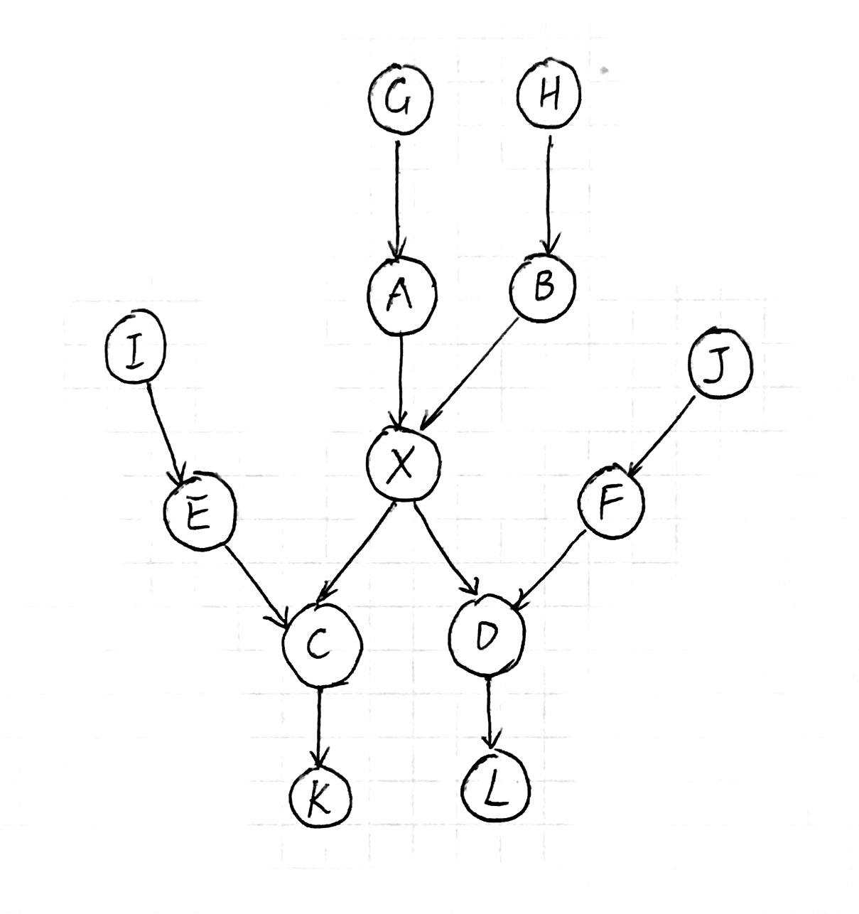
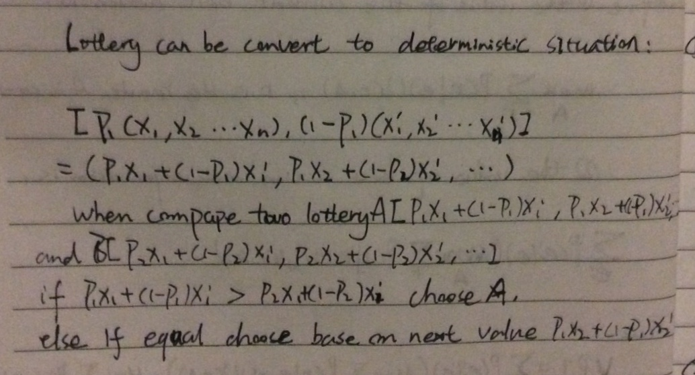
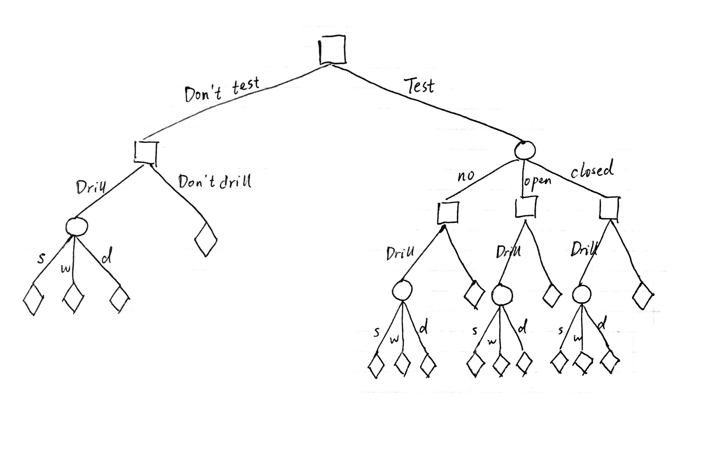
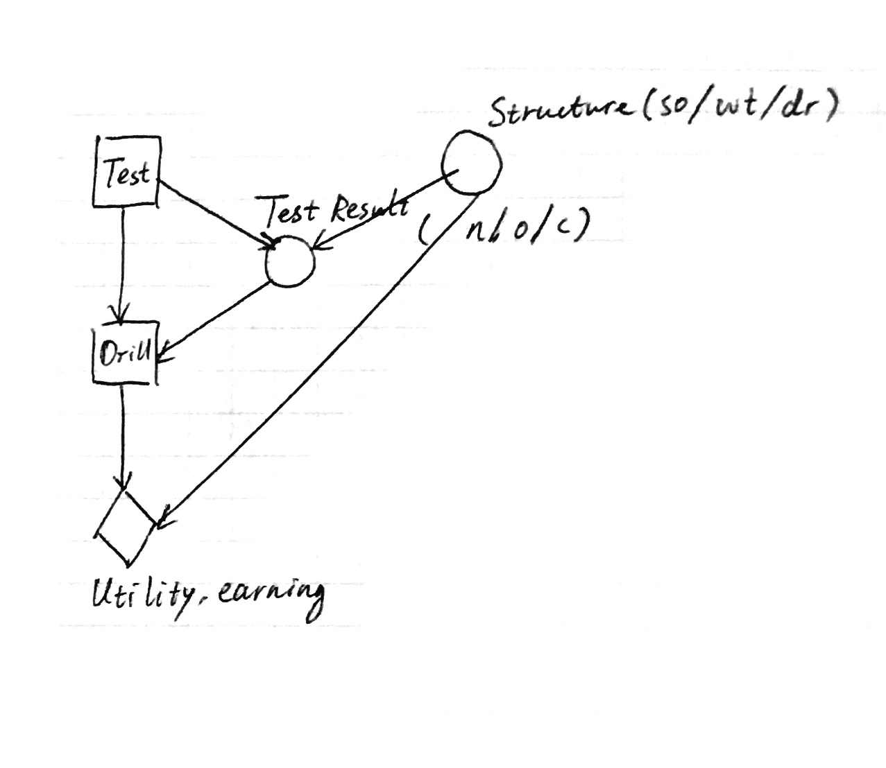
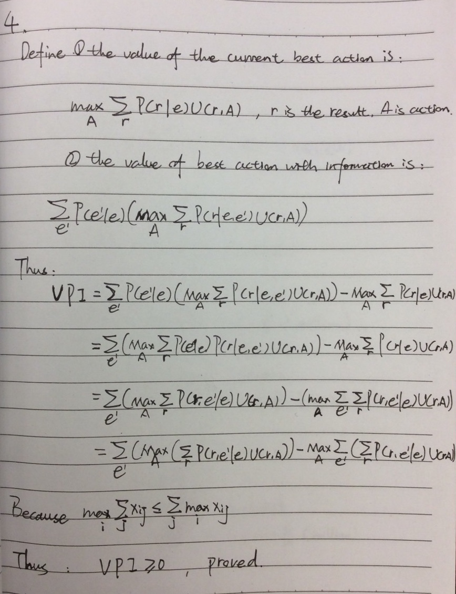
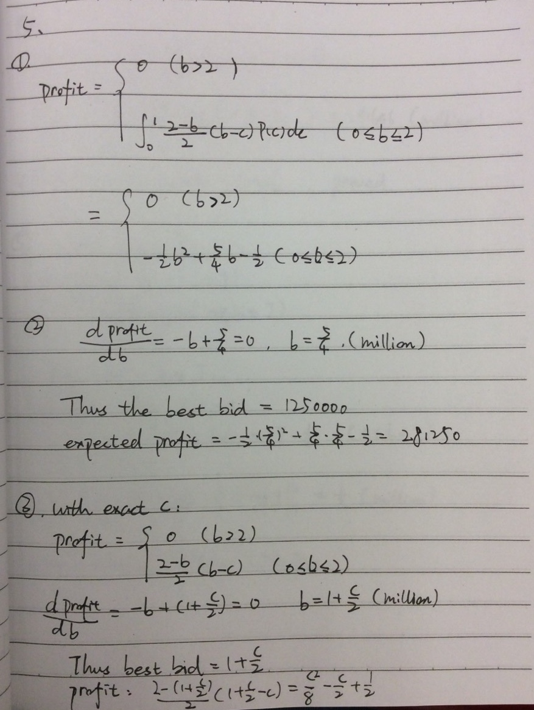
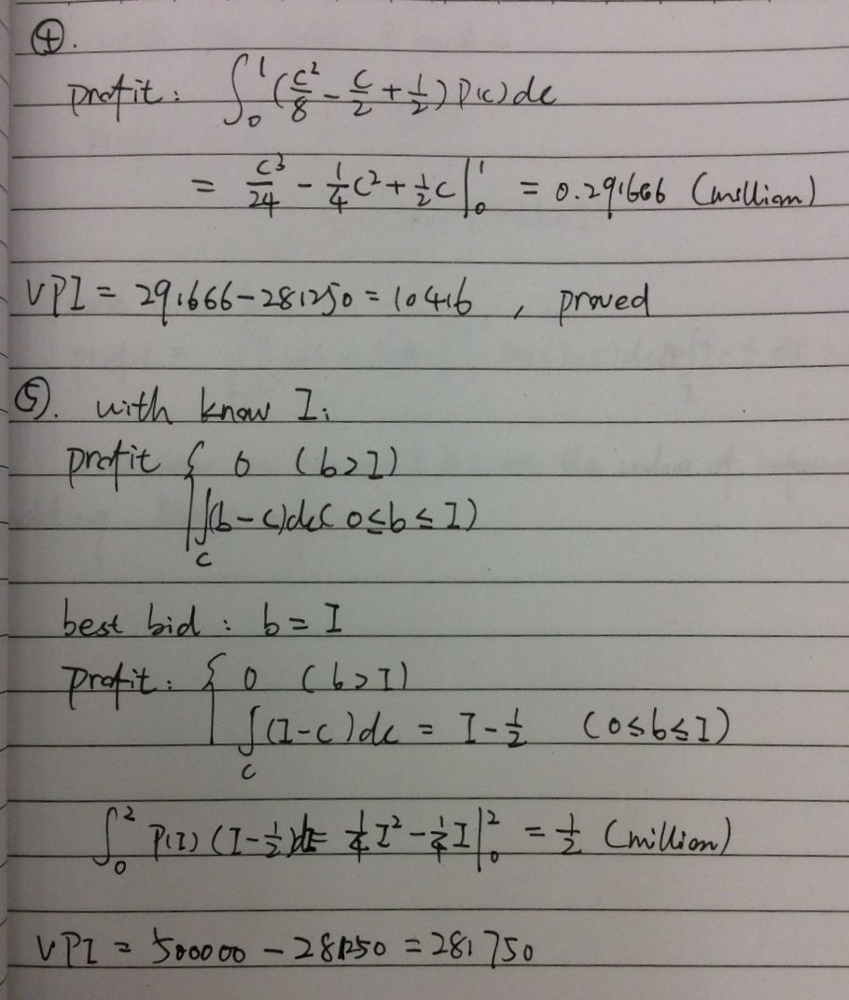
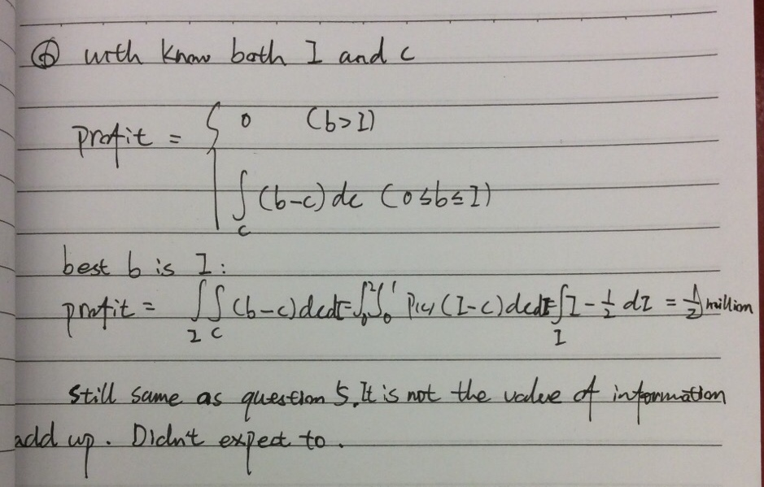

% CS683 Homework 05
% Cen Wang

# MCMC

## Proof

Suppose we have the following Bayesian network.


\ 

$$
\begin{aligned}
P(x_i \mid MB(X_i)) & = P(x_i \mid A, B, C, D, E, F) \\
                    & = \alpha P(x_i, A, B, C, D, E, F) \\
                    & = \alpha \sum_{G, H, I, J, K, L} P(x_i, A, B, C, D, E, F, G, H, I, J, K, L)
\end{aligned}
$$

According to the definition of Bayesian network, this equals to:

$$
\alpha \sum_{G, H, I, J, K, L} P(G) P(A \mid G) P(H) P(B \mid H) P(X \mid A, B) P(I) P(E \mid I) P(C \mid E, X) P(J) P(F \mid J) P(D \mid X, F) P(K | C) P(L \mid D)
$$

Using variable elimination, we can first eliminate $G$, $H$, $I$, $J$ and we have 

$$
\alpha \sum_{K, L} P(A) P(B) P(E) P(F) P(X \mid A, B) P(C \mid E, X) P(D \mid X, F) P(K \mid C) P(L \mid D)
$$

Then we notice that $\sum_{K} P(K \mid C) = 1$ and $\sum_{L} P(L \mid D) = 1$. So the original equation can be simplified to

$$
\alpha P(A) P(B) P(E) P(F) P(X \mid A, B) P(C \mid E, X) P(D \mid X, F)
$$

Also notice that $P(A)$, $P(B)$, $P(E)$, $P(F)$ have become known number after variable elimination. We can rewrite the previous equation as

$$
\alpha' P(X \mid A, B) P(C \mid E, X) P(D \mid X, F)
$$

Notice that $A$ and $B$ are $X$'s parents, $E$, $X$ are $C$'s parents and $X$, $F$ are $D$'s parents. This is the form we have in the original question.

We also argue that our Bayesian network is representative of all other networks. These networks can be ***reduced*** to our form. For example, if a network has multiple nodes as $A$'s parents, through variable elimination, we still find that they will finally be reduced to $P(A)$ as is argued before.

Therefore,

$$
P(x_i \mid MB(X_i)) = \alpha P(x_i \mid Parents(X_i)) \prod_{Y_j \in Children(X_i)} P(y_j \mid Parents(Y_j))
$$ is correct.

## XOR

MCMC works by first set evidence node $Z$ to 1 and then randomly initialize $X$ and $Y$. There are four possible initializations of $X$ and $Y$, which are listed below:

| X | Y | 
|---|---| 
| 0 | 0 | 
| 0 | 1 | 
| 1 | 0 | 
| 1 | 1 | 

Suppose we are in the first state and we first sample $X$. Because $P(X = 0 \mid Y = 0, Z = 1) = 0$ and $P(X = 1 \mid Y = 0, Z = 1) = 1$, $X$ will always become 1. Then, let's sample $Y$. Because $P(Y = 0 \mid X = 1, Z = 1) = 1$ and $P(Y = 1 \mid X = 1, Z = 1) = 0$, $Y$ will always remain unchanged. After first round, we have $X = 1$ and $Y = 0$. Once we are in this state it can be showed that $X$ will always be 1 and $Y$ will always be zero. That is our estimation of $P(X = 1 \mid Z = 1)$ is 1. The third initialization is the same as the first and the second and the forth initialization will always estimate $P(X = 1 \mid Z = 1)$ to be 0. This is because 1) MCMC generates samples according to Markov blanket of a variable (in our case, $X$ is generated by $P(X \mid Y, Z)$ and $Y$ is generated by $P(Y \mid X, Z)$); 2) $Z$ is deterministic function of $X$ and $Y$; 3) Once a particular state is reached, according to the deterministic function and corresponding probability, there is no way to step out of that state. This means all samples are the same.

## Noisy XOR

We find that the estimation becomes correct as N (sample number) becomes large. The lesson learned is that when we have some probability that is either 0 or 1, MCMC can step into a state and never gets out and thus make incorrect estimation. It is beneficial to rewrite 1 to $1 - \epsilon$ and 0 to $\epsilon$ to enable MCMC to have detailed balance between different states.

# Lexicographic Preference

## Deterministic outcomes definition

Suppose we have outcome X and Y, whose attributes are $X_1$, $X_2$, ... $X_n$ and $Y_1$, $Y_2$, ... $Y_n$ respectively.

$A \sim B$ if $\forall i, X_i = Y_i$

$A \succ B$ if $X_1 > Y_1$ or $X_j = Y_j \land X_i > Y_i$ for all $j = 1, 2, 3, ..., i - 1$

## Lottery definition


\ 

## Violation example

Yes. In utility theory, we have the continuity axiom, which says:

If $A \succ B \succ C$, then $\exists p \quad [p, A; 1 - p, C] \sim B$.

With lexicographic preference, consider the following example:

$A = (1, 0)$,  $B = (1, 0.5)$ and $C = (0, 1000)$. According to the definition, $A \succ B \succ C$. However, there is no way to find $p$ such that

$$
[p, (1, 0); 1 - p, (0, 1000)] \sim (1, 0.5)
$$

This is because if we want to be indifferent between the lottery, we must have $p = 1$, any $p$ that is not 1 will make us unhappy because we might have $(0, 1000)$ as outcome. However, if $p = 1$, this means we will deterministically get $(1, 0)$ as outcome. Apparently, we are not indifferent between $(1, 0)$ and $(1, 0.5)$.

## Lexicographic preference example

Buying a new mobile phone as an example. We may have

$X_1$ = the operating system of the phone

$X_2$ = if the phone is the latest model

$X_3$ = how many GB of storage the phone has

$X_4$ = how many GB of RAM the phone has.

We may say:

1. We only want an iOS phone (even if an Android phone is newer, has better storage and RAM, we don't want it)

2. We only want the latest iPhone X (64 GB storage and 2 GB RAM) instead of iPhone 7 with 128 GB storage and 3 GB RAM.

3. If this is the iPhone X, we want a 256 GB one instead of 64 GB one even the latter has 3 GB RAM rather than 2 GB. This is because we store a lot of books, music, photos.

4. If everything is the same, give us an iPhone X with the largest RAM.

# Oil Wildcatter


\ 


\ 

Joint distribution of $P(Structure, Test) = P(Test \mid Structure) P(Structure)$

|          | Structure = so | Structure = wt | Structure = dr | 
|----------|----------------|----------------|----------------| 
| Test = n | 0.02           | 0.09           | 0.3            | 
| Test = o | 0.06           | 0.12           | 0.15           | 
| Test = c | 0.12           | 0.09           | 0.05           | 

$P(n) = 0.41, P(o) = 0.33, P(c) = 0.26$

$$
P(s \mid n) = \frac{P(n \mid s) P(s)}{P(n)} = 0.02 / 0.41 = 0.04878
$$

Similarly, using Bayes' theorem, we can have all the posterior probabilities:

Test = n:

| Earning | Probability  | Weighted     |
|---------|--------------|--------------|
| 190000  | 0.0487804878 | 9268.292683  |
| 40000   | 0.2195121951 | 8780.487805  |
| -80000  | 0.7317073171 | -58536.58537 |
|         |              | -40487.80488 |

Test = o:

| Earning      | Probability | Weighted     |
|--------------|-------------|--------------|
| 0.1818181818 | 190000      | 34545.45455  |
| 0.3636363636 | 40000       | 14545.45455  |
| 0.4545454545 | -80000      | -36363.63636 |
|              |             | 12727.27273  |

Test = c:

| Earning      | Probability | Weighted     |
|--------------|-------------|--------------|
| 0.4615384615 | 190000      | 87692.30769  |
| 0.3461538462 | 40000       | 13846.15385  |
| 0.1923076923 | -80000      | -15384.61538 |
|              |             | 86153.84615  |

Therefore, the expected earning if we do the test is $(0.41)(-10000) + (0.33)(12727.27273) + (0.26)(86153.84615) = 22500$. If we don't do the test the expected earning is $(0.2)(200000) + (0.3)(50000) + (0.5)(-70000) = 20000$.

Without the information, the expected return is 20000. With the information, the expected return is 22500. Therefore, the value of information is 2500. The best strategy is:

```
do_test
if test_result == no structure:
    do_not_drill
else:
    drill
```

# Value of Perfect Information


\ 

Illustration purpose, insider trading is illegal. Consider a situation that a friend from Facebook knows the company's privacy scandal is going to be reported before the stock market knows. He shares this information with you. It's easy to make a reasonable decision to sell short of Facebook's stock immediately. Let's say you have another friend from Facebook who also knows the scandal. But instead of sharing with you the information directly, he gives you a billion rows of logs collected from Facebook data center, how much money is made on every of the one billion users, together with the scandal information. In this case, even if this friend tells you even more about Facebook, and you can theoretically make better decision with these information, you don't have enough computational resources to process all the data in reasonable time. If you don't have the time to read the truly important scandal information before you have to make the investment, you will make a decision that is different from the first one and it will be worse.

# Extra Credit


\ 


\ 


\ 
